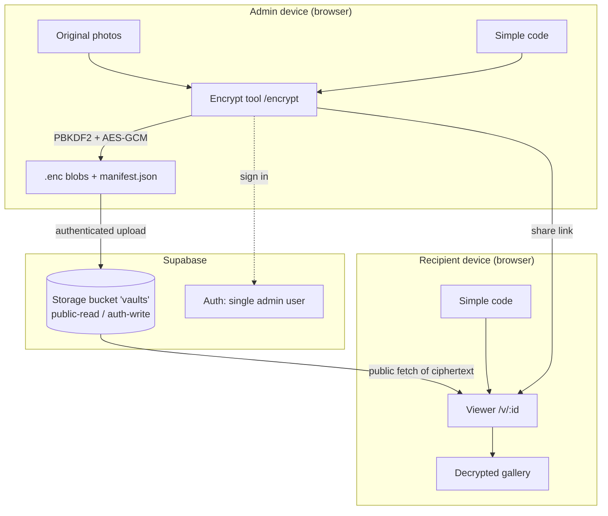
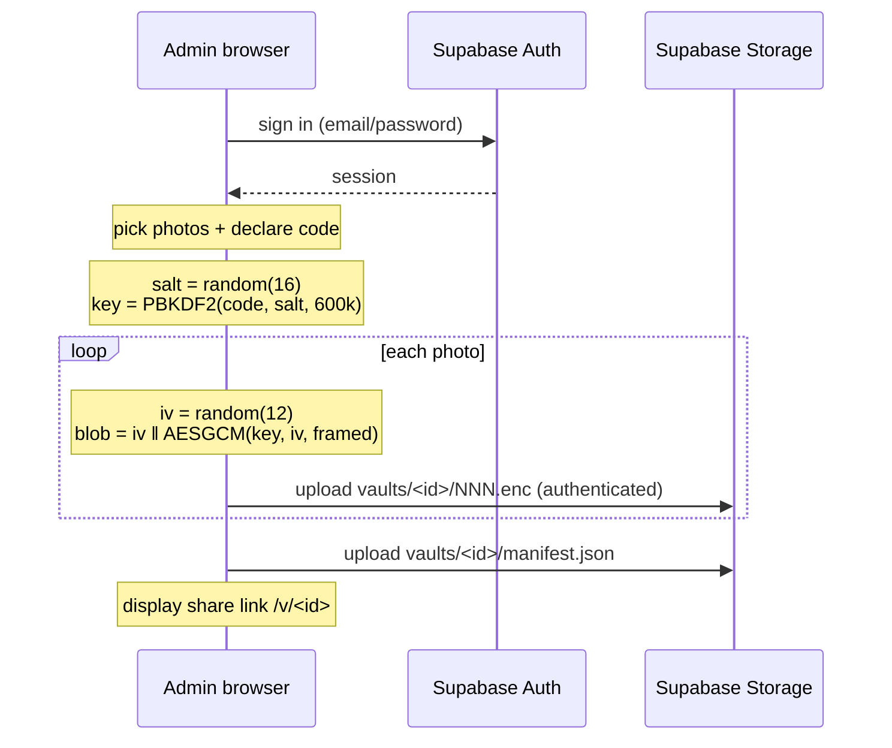
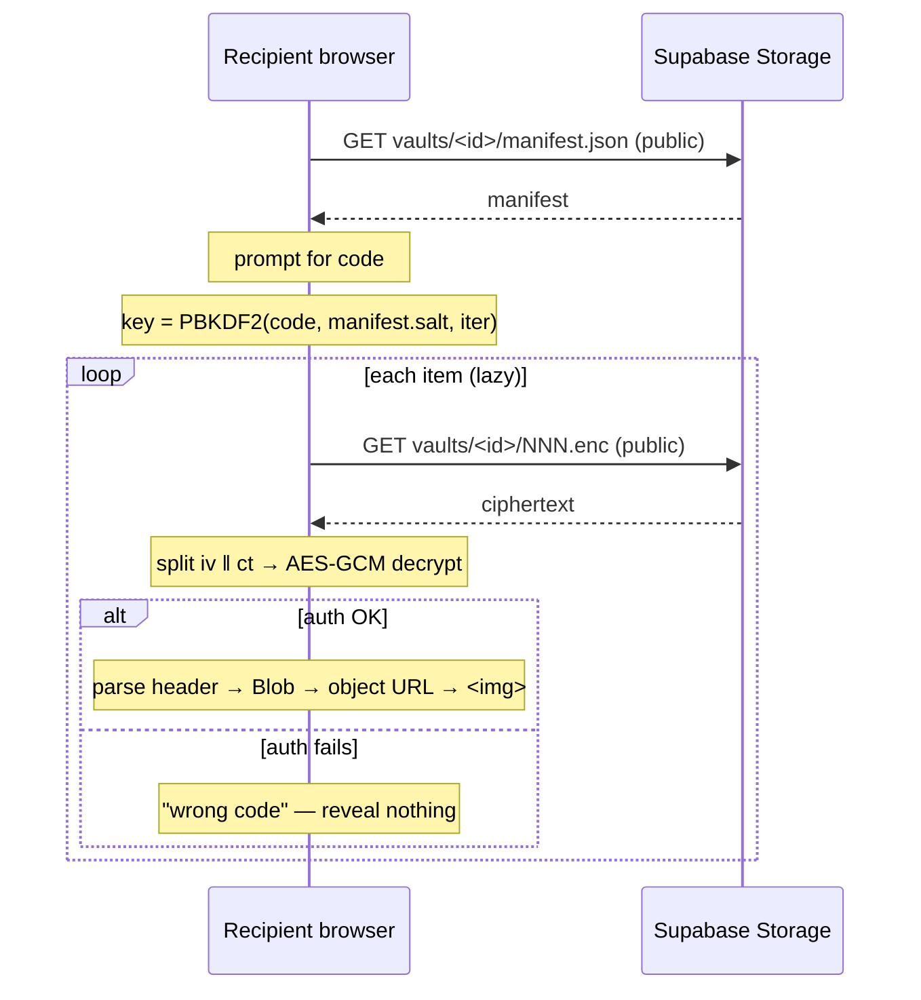

# High-Level Design — Encrypted Photo Vault

**Status:** planned (nothing built yet)
**Last updated:** 2026-07-16

---

## 1. Purpose

A client-side encrypted photo vault. An admin selects photos and declares a simple
code. The photos are encrypted **in the browser** and the resulting ciphertext is
uploaded to cloud storage. Anyone with the share link sees nothing until they type the
code, at which point the photos are decrypted **in their browser** and rendered.

The defining property: **plaintext photos never leave the admin's device, and the
server never holds a key.** The stored bytes are unreadable to the host, to us, and to
anyone with the link who lacks the code.


## 2. Goals / Non-goals

**Goals**
- Real encryption (AES-GCM).
- Key derived from an admin-declared code; no key or code ever stored or transmitted.
- Photos shareable over the network via a link.
- Zero custom backend code — cloud config only.
- Mobile-first viewing.

**Non-goals**
- Multi-user accounts, per-recipient permissions, or revocation.
- Resistance to a determined attacker brute-forcing a short code (see §4).
- Server-side rendering, thumbnails, or transcoding (server can't read the photos).
- Editing, deleting, or re-keying an existing vault (v1 is write-once).

## 3. Architecture



**Components**

| Component | Responsibility |
|---|---|
| `/encrypt` (React route) | Admin-only. Sign in, pick photos, encrypt locally, upload, emit share link. |
| `/v/:id` (React route) | Public. Fetch manifest + blobs, prompt for code, decrypt, render gallery. |
| `crypto core` (module) | PBKDF2 key derivation, AES-GCM encrypt/decrypt, payload framing. Pure, testable, no I/O. |
| Supabase Auth | Gates who may upload. One admin account. |
| Supabase Storage | Holds ciphertext. Public-read, authenticated-write. |

Note there is **no application server**. The "backend" is entirely Supabase
configuration (a bucket plus two storage policies). The encrypt tool talks to Storage
directly through the Supabase JS SDK using the admin's authenticated session.

## 4. Security model

**What protects the photos:** AES-GCM-256 with a key derived from the code. That is the
only thing. The ciphertext itself is public.

**Trust boundaries**
- *Plaintext* exists only in the admin's browser memory (pre-upload) and the
  recipient's browser memory (post-decrypt). Never on the wire, never at rest.
- *Ciphertext* is public-read in the bucket. Anyone with the vault ID can download it.
- *The code* is never uploaded, never in the manifest, never hashed anywhere. It travels
  out-of-band (spoken, separate message).
- *Supabase* is untrusted with content by construction — it stores opaque bytes.

**Defense layers**
1. The **code** — the real gate. Wrong code ⇒ GCM authentication fails ⇒ nothing decrypts.
2. The **vault ID** — a random, unguessable identifier. Acts as a capability URL, so
   ciphertext isn't discoverable by enumeration. Defense-in-depth, not a real gate.
3. **Auth on write** — only the admin can create vaults; the bucket isn't an open dropbox.

**Accepted risks** (decided deliberately, do not relitigate)
- **A simple code is brute-forceable offline.** Anyone who downloads the ciphertext can
  attack it at their own pace. PBKDF2 at high iterations raises the cost per guess but
  cannot rescue a short dictionary word. This is accepted for a personal, low-stakes
  vault.
- **Sharing is irreversible.** CDNs and link-preview crawlers cache. Deleting from the
  bucket does not guarantee copies vanish. Assume anything shared is permanent.
- **Metadata leaks.** Filenames and MIME types are hidden inside the encrypted payload,
  but the **number** of photos and their approximate **sizes** (ciphertext ≈ plaintext)
  are visible to anyone who fetches the vault.
- **EXIF is preserved.** Photos are encrypted byte-for-byte, so GPS/camera/timestamp data
  survives decryption and is visible to whoever has the code. Chosen to preserve original
  quality (no re-encode).
- **The manifest is not signed.** Its integrity rests on TLS. Tampering with the KDF
  params gains an attacker nothing — they still need the code.

## 5. Cryptographic design

All primitives are native **WebCrypto (`crypto.subtle`)**. No crypto libraries.

**Key derivation**
- Algorithm: **PBKDF2-HMAC-SHA-256**
- Salt: 16 random bytes, generated once per vault, stored in the manifest (salts are not secret)
- Iterations: **600,000**
- Output: **256-bit AES-GCM key**
- Derived once per vault; the same key encrypts every photo in it.

**Encryption**
- Algorithm: **AES-GCM-256**, 128-bit authentication tag
- IV: **12 random bytes, fresh per file** (never reused under the same key — this is critical)
- Wrong-code detection is free: GCM authentication failure *is* the signal. No code
  hash, no verifier blob, nothing to attack offline beyond the ciphertext itself.

**Argon2 was considered and rejected** for v1: it would require a WASM dependency.
PBKDF2 is native and adequate given the code strength is the binding constraint anyway.
Recorded as an upgrade path.

## 6. Data formats

### `.enc` file (binary)

```
┌──────────────┬────────────────────────────────────────────┐
│  IV (12 B)   │  AES-GCM ciphertext ‖ auth tag (16 B)      │
└──────────────┴────────────────────────────────────────────┘
```

The encrypted plaintext, before encryption, is framed as:

```
┌───────────────┬─────────────────────┬──────────────────────┐
│ headerLen     │ header (JSON, UTF-8)│ raw photo bytes      │
│ (4 B, BE u32) │ {"name":…,"type":…} │ (byte-for-byte)      │
└───────────────┴─────────────────────┴──────────────────────┘
```

Framing the header *inside* the encrypted region is what keeps original filenames and
MIME types secret; the object names in storage are opaque (`001.enc`, `002.enc`).

### `manifest.json` (public, plaintext)

```jsonc
{
  "v": 1,
  "kdf": { "name": "PBKDF2", "hash": "SHA-256", "iter": 600000 },
  "salt": "<base64, 16 bytes>",
  "items": [{ "enc": "001.enc" }, { "enc": "002.enc" }]
}
```

Deliberately contains **no** filenames, types, dimensions, or code material — only what
is needed to derive the key and locate the blobs.

### Storage layout

```
vaults/<vaultId>/manifest.json
vaults/<vaultId>/001.enc
vaults/<vaultId>/002.enc
```

`vaultId`: 16 random bytes, base64url-encoded — unguessable.

## 7. Key flows

### Encrypt & publish



The code and the key exist only in the admin tab's memory and are discarded on unload.

### View & decrypt



Object URLs are revoked on unmount so decrypted images don't linger. Nothing is written
to disk unless the recipient explicitly saves a photo.

## 8. Tech stack

| Layer | Choice |
|---|---|
| App | Vite + React + TypeScript |
| Crypto | Native WebCrypto (`crypto.subtle`) — no libraries |
| Storage / Auth | Supabase (bucket `vaults`, Auth single admin) |
| App hosting | Static deploy (Netlify / Vercel / Cloudflare Pages / GH Pages) |
| Client config | `VITE_SUPABASE_URL`, `VITE_SUPABASE_ANON_KEY` (both public-safe) |

**Hard requirement:** `crypto.subtle` is only available in a **secure context**. The app
must be served over HTTPS (or `localhost` in dev). Opening the build from `file://` will
not work.

## 9. Supabase configuration (manual, one-time)

1. Create a project → note the **Project URL** and **anon key**.
2. Create bucket `vaults`, marked **public** (public read).
3. Storage policies: `SELECT` → public; `INSERT` → authenticated only.
4. Create one admin user (email/password) in Auth.

No service-role key ever reaches the client. The anon key is designed to be public; the
write gate is the policy, not the key.

## 10. Build order

1. Scaffold Vite + React + TS; routes; aubergine/foil design shell.
2. **Crypto core** + round-trip unit tests (encrypt → decrypt → byte-identical).
3. Encrypt tool against **local download** (no cloud).
4. Viewer decrypting from **local files**.
5. Wire Supabase (auth → upload → public fetch).
6. Rewrite `context.md` to match this design.

Steps 1–4 have no cloud dependency and can proceed before Supabase exists.


## 12. Future work

- Argon2id via WASM to raise per-guess cost.
- Vault expiry / deletion (bucket lifecycle rules).
- Optional EXIF stripping as an encrypt-time toggle.
- Streaming encryption for very large files (chunked GCM) — current design loads whole
  files into memory.
- Private bucket + signed read URLs, so ciphertext isn't publicly fetchable at all.
